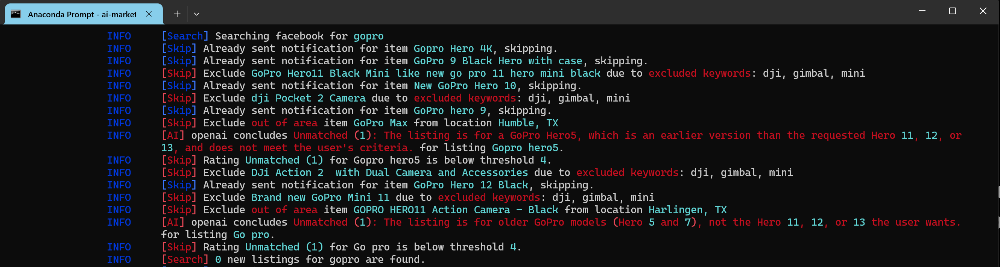

<div align="center">

[](https://pypi.python.org/pypi/ai-marketplace-monitor)
[](https://pypi.python.org/pypi/ai-marketplace-monitor)
[](https://github.com/BoPeng/ai-marketplace-monitor/actions?workflow=tests)
[](https://codecov.io/gh/BoPeng/ai-marketplace-monitor)
[](https://ai-marketplace-monitor.readthedocs.io/)
[](https://pypi.python.org/pypi/ai-marketplace-monitor)

[](https://github.com/psf/black)
[](https://github.com/pre-commit/pre-commit)
[](https://www.contributor-covenant.org/version/2/1/code_of_conduct/)

</div>

An intelligent tool that monitors Facebook Marketplace listings using AI to help you find the best deals. Get instant notifications when items matching your criteria are posted, with AI-powered analysis of each listing.

**📚 [Read the Full Documentation](https://ai-marketplace-monitor.readthedocs.io/)**



Example notification from PushBullet:

```
Found 1 new gopro from facebook
[Great deal (5)] Go Pro hero 12
$180, Houston, TX
https://facebook.com/marketplace/item/1234567890
AI: Great deal; A well-priced, well-maintained camera meets all search criteria, with extra battery and charger.
```

**Table of Contents:**

- [✨ Key Features](#-key-features)
- [🚀 Quick Start](#-quick-start)
- [💡 Example Usage](#-example-usage)
- [📚 Documentation](#-documentation)
- [🤝 Contributing](#-contributing)
- [📜 License](#-license)
- [💬 Support](#-support)
- [🙏 Credits](#-credits)

## ✨ Key Features

🔍 **Smart Search**

- Search multiple products using keywords
- Filter by price and location
- Exclude irrelevant results and spammers
- Support for different Facebook Marketplace layouts

🤖 **AI-Powered**

- Intelligent listing evaluation using advanced language models
- Unified interface supporting multiple AI providers (OpenAI, DeepSeek, Ollama, OpenRouter)
- Reliable processing with automatic retries and improved error handling
- Optional LangSmith integration for monitoring and debugging
- Smart recommendations with consistent response formatting

📱 **Notifications**

- PushBullet, PushOver, Telegram, or Ntfy notifications
- HTML email notifications with images
- Customizable notification levels
- Repeated notification options

🌎 **Location Support**

- Multi-city search
- Pre-defined regions (USA, Canada, etc.)
- Customizable search radius
- Flexible seller location filtering

## Architecture Overview

AI Marketplace Monitor has evolved to use a modern, unified AI architecture powered by LangChain. This change was driven by the need to support multiple AI providers consistently while improving reliability and maintainability.

> **Note:** This migration implements the first phase of GitHub issue #187, providing a unified LangChain interface. Future releases will add advanced LangGraph capabilities for multi-agent workflows and complex reasoning chains.

### Before: Direct Provider Integration
Previously, the application used separate backend classes for each AI provider (OpenAIBackend, DeepSeekBackend, etc.) with provider-specific code paths and error handling.

### After: Unified LangChain Architecture
The new architecture uses a single `LangChainBackend` class that provides:

- **Unified Interface**: All AI providers work through the same consistent LangChain-based API
- **Provider Mapping System**: Automatic translation between configuration formats and LangChain models
- **Better Error Handling**: Improved exception mapping with clearer error messages
- **Built-in Reliability**: Automatic retries, connection management, and failover
- **Token Usage Tracking**: Detailed cost monitoring across all providers
- **Thread Safety**: Concurrent evaluation support for better performance

### Key Architectural Components

```
Configuration Layer
    ↓
Provider Mapping System (ai.py)
    ↓
LangChain Models (ChatOpenAI, ChatDeepSeek, ChatOllama, etc.)
    ↓
Unified Response Processing
    ↓
AIResponse with Token Usage & Metadata
```

### Backward Compatibility
All existing configurations continue to work unchanged. The system automatically maps legacy settings to the new architecture while preserving all functionality.

### Future Development: LangGraph Integration
This release establishes the foundation for future LangGraph integration, which will enable:
- Multi-agent coordination for complex marketplace analysis
- Advanced reasoning chains and decision trees
- Automatic model failover and optimization
- Enhanced workflow orchestration capabilities

See [GitHub issue #187](https://github.com/BoPeng/ai-marketplace-monitor/issues/187) for the complete roadmap.

## 🚀 Quick Start

> **⚠️ Legal Notice**: Facebook's EULA prohibits automated data collection without authorization. This tool was developed for personal, hobbyist use only. You are solely responsible for ensuring compliance with platform terms and applicable laws.

### Installation

```bash
pip install ai-marketplace-monitor
playwright install
```

### Basic Configuration

Create `~/.ai-marketplace-monitor/config.toml`:

```toml
[marketplace.facebook]
search_city = 'houston'  # Replace with your city

[item.gopro]
search_phrases = 'Go Pro Hero 11'
min_price = 100
max_price = 300

[user.me]
pushbullet_token = 'your_token_here'  # Get from pushbullet.com
```

### Run the Monitor

```bash
ai-marketplace-monitor
```

The program will open a browser, search Facebook Marketplace, and notify you of matching items.

## 💡 Example Usage

**Find GoPro cameras under $300:**

```toml
[item.gopro]
search_phrases = 'Go Pro Hero'
keywords = "('Go Pro' OR gopro) AND (11 OR 12 OR 13)"
min_price = 100
max_price = 300
```

**Search nationwide with shipping:**

```toml
[item.rare_item]
search_phrases = 'vintage collectible'
search_region = 'usa'
delivery_method = 'shipping'
seller_locations = []
```

**AI-powered filtering:**

```toml
[ai.openai]
api_key = 'your_openai_key'

[item.camera]
description = '''High-quality DSLR camera in good condition.
Exclude listings with water damage or missing parts.'''
rating = 4  # Only notify for 4+ star AI ratings
```

## 📚 Documentation

For detailed information on setup and advanced features, see the comprehensive documentation:

- **[📖 Full Documentation](https://ai-marketplace-monitor.readthedocs.io/)** - Complete guide and reference
- **[🚀 Quick Start Guide](https://ai-marketplace-monitor.readthedocs.io/en/latest/quickstart.html)** - Get up and running in 10 minutes
- **[🔍 Features Overview](https://ai-marketplace-monitor.readthedocs.io/en/latest/features.html)** - Complete feature list
- **[📱 Usage Guide](https://ai-marketplace-monitor.readthedocs.io/en/latest/usage.html)** - Command-line options and tips
- **[🔧 Configuration Guide](https://ai-marketplace-monitor.readthedocs.io/en/latest/configuration-guide.html)** - Notifications, AI prompts, multi-location search
- **[⚙️ Configuration Reference](https://ai-marketplace-monitor.readthedocs.io/en/latest/configuration.html)** - Complete configuration reference

### Key Topics Covered in Documentation

**Notification Setup:**

- Email (SMTP), PushBullet, PushOver, Telegram, Ntfy
- Multi-user configurations
- HTML email templates

**AI Integration:**

- OpenAI, DeepSeek, Ollama setup
- Custom prompt configuration
- Rating thresholds and filtering

**Advanced Search:**

- Multi-city and region search
- Currency conversion
- Keyword filtering with Boolean logic
- Proxy/anonymous searching

**Configuration:**

- TOML file structure
- Environment variables
- Multiple marketplace support
- Language/translation support

## Advanced Features

### Support for Non-English Languages

If you encounter an error message like:

```
Failed to get details of listing https://www.facebook.com/marketplace/item/12121212121212121212
The listing might be missing key information (e.g. seller) or not in English.
Please add option language to your marketplace configuration is the latter is the case.
See https://github.com/BoPeng/ai-marketplace-monitor?tab=readme-ov-file#support-for-non-english-languages for details.
```

you will need to check `Setting -> Language` settings of your facebook account,
and let _AI Marketplace Monitor_ use the same language.

Currently, _AI Marketplace Monitor_ supports the following languages

- `es`: Spanish
- `zh`: Chinese

If your language is not defined, you will need to define your own [`translation` section](docs/README.md#translators) in your configuration file, following a format used by existing translators defined in [config.toml](https://github.com/BoPeng/ai-marketplace-monitor/blob/main/src/ai_marketplace_monitor/config.toml). This can be done by

1. Add a section to your configuration file, by copying one example from the system translators, for example,

```toml
[translator.LAN]
locale = "Your REGION"
"About this vehicle" = "Descripción del vendedor"
"Seller's description" = "Información sobre este vehículo"
"Collection of Marketplace items" = "Colección de artículos de Marketplace"
"Condition" = "Estado"
"Details" = "Detalles"
"Location is approximate" = "La ubicación es aproximada"
"Description" = "Descripción"
```

2. Find example listings (from for example [here](https://github.com/BoPeng/ai-marketplace-monitor/issues/29#issuecomment-2632057196)), locate the relevant words, and update the section. You can switch between different langauges (Facebook -> Settings -> Language) and see the location of the English version.

3. After you have completed the translation, add `language="LAN"` to the `marketplace` section as follows:

```toml
[translation.LAN]
"Condition" = "Condition in your LAN"
"Details" = "Details in your LAN"
...
```

in your configuration file, then add `language="LAN"` to the `marketplace` section as follows:

```toml
[marketplace.facebook]
language = "LAN"
```

It would be very helpful for other users of _AI Marketplace Monitor_ if you could contribute your dictionary to this project by creating a pull request or simply creating a ticket with your translations.

### Check individual listing

If you ever wonder why a listing was excluded, or just want to check a listing against your configuration, you can get the URL (or the item ID) of the listing, and run

```sh
ai-marketplace-monitor --check your-url
```

If you have multiple items specified in your config file, _ai-marketplace-monitor_ will check the product against the configuration of all of them. If you know the _name_ of the item in your config file, you can let the program only check the configuration of this particular item.

```sh
ai-marketplace-monitor --check your-url --for item_name
```

Option `--check` will load the details of the item from the cache if it was previously examined. Otherwise a browser will be started to retrieve the page.

Another way to check individual IDs is to enter interactive mode when the _ai-marketplace-monitor_ is running. If you press `Esc`, then confirm with `c` when prompted, you can enter the `URL` and `item_name` interactively and check the URL. Enter `exit` to exit the interactive session after you are done. However, using this method requires OS to allow the program to monitor your keyboard. It would not work on a terminal accessed through SSH, and you have to allow the terminal that you use to run _ai-marketplace-monitor_ to monitor keyboard from the _Privacy and Security_ settings on MacOS.

### Multiple marketplaces

Although facebook is currently the only supported marketplace, you can create multiple marketplaces such as`marketplace.city1` and `marketplace.city2` with different options such as `search_city`, `search_region`, `seller_locations`, and `notify`. You will need to add options like `marketplace='city1'` in the items section to link these items to the right marketplace.

For example

```toml
[marketplace.facebook]
search_city = 'houston'
seller_locations = ['houston', 'sugarland']

[marketplace.nationwide]
search_region = 'usa'
seller_location = []
delivery_method = 'shipping'

[item.default_item]
search_phrases = 'local item for default market "facebook"'

[item.rare_item1]
marketplace = 'nationwide'
search_phrases = 'rare item1'

[item.rare_item2]
marketplace = 'nationwide'
search_phrases = 'rare item2'
```

If no `marketplace` is defined for an item, it will use the first defined marketplace, which is `houston` in this example.

### First and subsequent searches

A list of two values can be specified for options `rating`, `availability`, `date_listed`, and `delivery_method`, with the first one used for the first search, and second one used for the rest of searches. This allows the use of different search strategies for first and subsequent searches. For example, an initial more lenient search for all listings followed by searches for only new listings can be specified as

```
rating = [2, 4]
availability = ["all", "in"]
date_listed = ["all", "last 24 hours"]
```

### Showing statistics

_ai-marketplace-monitor_ shows statistics such as the number of pages searched, number of listings examined and excluded, number of matching lists found and number of users notified when you exit the program. If you would like to see the statistics during monitoring, press `Esc` and wait till the current search to end.

Counters are persistent across program runs. If you would like to reset the counters, use

```
ai-marketplace-monitor --clear-cache counters
```

### Self-hosted Ollama Model

If you have access to a decent machine and prefer not to pay for AI services from OpenAI or other vendors. You can opt to install Ollama locally and access it using the `provider = "ollama"`. If you have ollama on your local host, you can use

```
[ai.ollama]
base_url = "http://localhost:11434/v1"
model = "deepseek-r1:14b"
timeout = 120
```

Note that

1. Depending on your hardware configuration, you can choose any of the models listed [here](https://ollama.com/search). The default model is `deepseek-r1:14b` becaue it appears to work better than `llama-3.1:8b`.
2. You need to `pull` the model before you can use it.

### Cache Management

_ai-marketplace-monitor_ caches listing details, ai inquiries, and user notifications to avoid repeated queries to marketplaces, AI services, and repeated notification. If for any reason you would like to clear the cache, you can use commands such as

```
ai-marketplace-monitor --clear-cache listing-details
```

to clear the cache. The following cache types are supported

- `listing-details`
- `ai-inquiries`
- `user-notification`
- `counters`

`--clear-cache all` is also possible but not recommended.

### Support for different layouts of facebook listings

Facebook marketplace supports a wide variety of products and use different layouts for them. _ai_marketplace_monitor_ can extract description from common listings such as household items and automobiles, but you may encounter items that this program cannot handle.

Although I certainly do not have the bandwidth to support all possible layouts, I have listed detailed steps on how to debug and resolve the issue on [issue 29](https://github.com/BoPeng/ai-marketplace-monitor/issues/29).

### Searching Anonymously with a Proxy Server

You can search Facebook Marketplace anonymously by disabling login,

- Do not provide a `username` or `password` in the `facebook` section
- (optional) Set `login_wait_time = 0` to stop waiting for login
- (optional) Use the `--headless` command line option to run `ai-marketplace-monitor` without a browser window.

If you would like to use a proxy server, you can

- Sign up for a VPN or proxy service.
- Configure the proxy settings in the `monitor` section of your configuration file as follows

```toml
[monitor]
proxy_server = '${PROXY_SERVER}'
proxy_username = '${PROXY_USERNAME}'
proxy_password = '${PROXY_PASSWORD}'
```

Replace `${PROXY_SERVER}`, `${PROXY_USERNAME}`, and `${PROXY_PASSWORD}` with your proxy service details, or setting the corresponding environment variables.

## Documentation

- **[Configuration Reference](docs/configuration-reference.md)** - Complete setup examples and environment variables
- **[Troubleshooting Guide](docs/troubleshooting.md)** - Solutions for common issues
- **[Developer Guide](docs/developer-guide.md)** - Development workflow and testing procedures
- **[AI Providers Guide](docs/ai-providers.md)** - Backend architecture and provider details
- **[Migration Guide](docs/migration-guide.md)** - Upgrade help for existing users
- **[LangSmith Integration](docs/langsmith-integration.md)** - Optional AI monitoring and debugging
- **[API Reference](docs/api-reference.md)** - Technical backend documentation

## 🤝 Contributing

Contributions are welcome! Here are some ways you can contribute:

- 🐛 Report bugs and issues
- 💡 Suggest new features
- 🔧 Submit pull requests
- 📚 Improve documentation
- 🏪 Add support for new marketplaces
- 🌍 Add support for new regions and languages
- 🤖 Add support for new AI providers
- 📱 Add new notification methods

Please read our [Contributing Guidelines](https://ai-marketplace-monitor.readthedocs.io/en/latest/contributing.html) before submitting a Pull Request.

## 📜 License

This project is licensed under the **Affero General Public License (AGPL)**. For the full terms and conditions, please refer to the official [GNU AGPL v3](https://www.gnu.org/licenses/agpl-3.0.en.html).

## 💬 Support

We provide multiple ways to access support and contribute to AI Marketplace Monitor:

- 📖 [Documentation](https://ai-marketplace-monitor.readthedocs.io/) - Comprehensive guides and instructions
- 🤝 [Discussions](https://github.com/BoPeng/ai-marketplace-monitor/discussions) - Community support and ideas
- 🐛 [Issues](https://github.com/BoPeng/ai-marketplace-monitor/issues) - Bug reports and feature requests
- 💖 [Become a sponsor](https://github.com/sponsors/BoPeng) - Support development
- 💰 [Donate via PayPal](https://www.paypal.com/donate/?hosted_button_id=3WT5JPQ2793BN) - Alternative donation method

**Important Note:** Due to time constraints, priority support is provided to sponsors and donors. For general questions, please use the GitHub Discussions or Issues.

## 🙏 Credits

- Some of the code was copied from [facebook-marketplace-scraper](https://github.com/passivebot/facebook-marketplace-scraper).
- Region definitions were copied from [facebook-marketplace-nationwide](https://github.com/gmoz22/facebook-marketplace-nationwide/), which is released under an MIT license as of Jan 2025.
- This package was created with [Cookiecutter](https://github.com/cookiecutter/cookiecutter) and the [cookiecutter-modern-pypackage](https://github.com/fedejaure/cookiecutter-modern-pypackage) project template.
